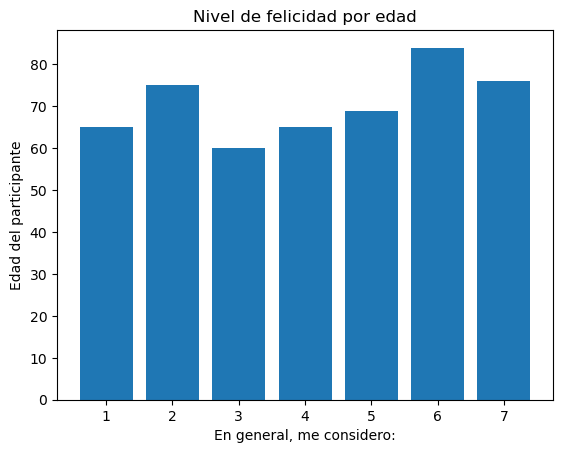
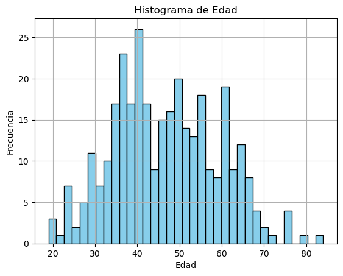
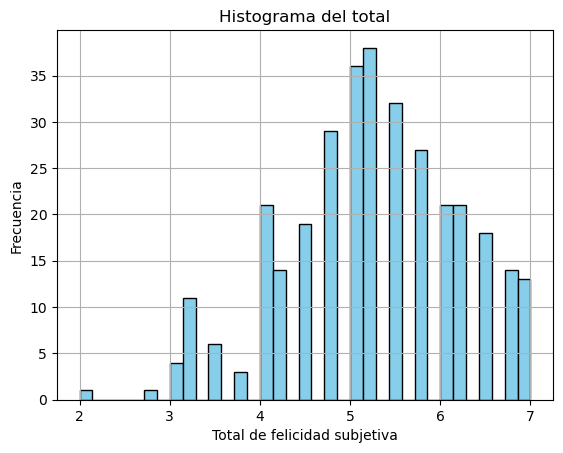
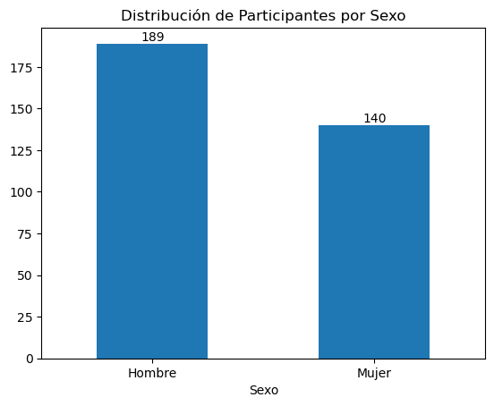
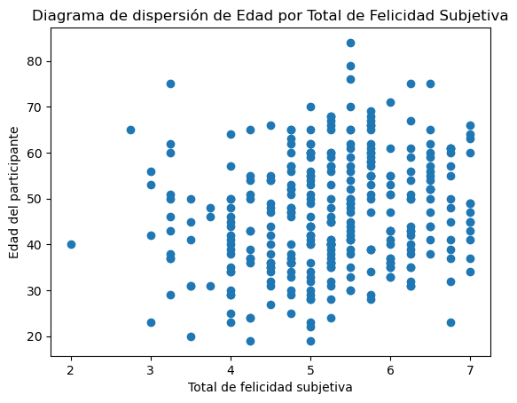
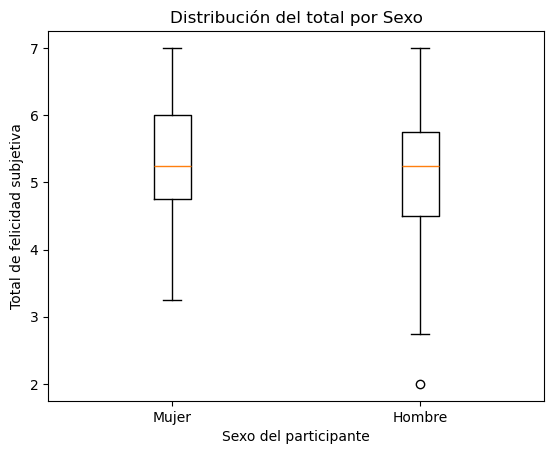

```python
import pandas as pd 
import numpy as np
from scipy import stats 
import matplotlib.pyplot as plt
```


```python
doc = pd.read_csv("paso_2.csv")
```

# PILAR 2: PRIMER PISO
# PREPARACIÓN DE LOS DATOS

Se verifica que no existen valores null


```python
if doc.isna().any().any() == True:
    print("hay valores null")
else:
    print("No esisten valores null")
```

    No esisten valores null
    

Se verifican los valores unicos de la columna Sexo


```python
doc[doc.columns[1]].unique()
```


    array(['Mujer', 'Hombre'], dtype=object)


Se verifican los valores unicos de la columna edad. Ya que hay dos columnas, se eliminara la que tiene valores no numericos.


```python
doc[doc.columns[2]].unique() 
```


    array(['33', '41', '46', '37', '45', '28', '40', '38', '57', '31', '36',
           '54', '62', '43', '44', '29', '20', '30', '68', '32', '52', '76',
           '47', '84', '49', '25', '51', '24', '53', '34', '50', '48', '39',
           '61', '55', '56', '66', '70', '35', '75', '42', 'Veintitrés ',
           '60', '79', '65', '23', '69', '58', '64', '67', '59', '57 años',
           '19', '27', '71', '63', '22', 'Tengo treinta y seis'], dtype=object)


```python
doc[doc.columns[3]].unique() 
```


    array([33, 41, 46, 37, 45, 28, 42, 40, 38, 57, 31, 36, 54, 62, 43, 44, 29,
           20, 30, 68, 32, 52, 76, 47, 84, 49, 25, 51, 24, 53, 34, 50, 48, 39,
           61, 55, 56, 66, 70, 35, 75, 23, 60, 79, 65, 69, 58, 64, 67, 59, 19,
           27, 71, 63, 22])


```python
doc = doc.drop(columns = [doc.columns[2]])
```


```python
doc
```


<div>
<style scoped>
    .dataframe tbody tr th:only-of-type {
        vertical-align: middle;
    }

    .dataframe tbody tr th {
        vertical-align: top;
    }

    .dataframe thead th {
        text-align: right;
    }
</style>
<table border="1" class="dataframe">
  <thead>
    <tr style="text-align: right;">
      <th></th>
      <th>Marca temporal</th>
      <th>¿Cuál es tu sexo biológico?</th>
      <th>Edad</th>
      <th>1. En general, me considero:</th>
      <th>2. Comparado con la mayoría de la gente que me rodea, me considero:</th>
      <th>3. Algunas personas suelen ser muy felices. Disfrutan la vida a pesar de lo que ocurra, afrontando la mayoría de las cosas. ¿En qué medida te consideras una persona así?</th>
      <th>4. Algunas personas suelen ser muy poco felices. Aunque no están deprimidas, no parecen tan felices como ellas quisieran. ¿En qué medida te consideras una persona así?</th>
    </tr>
  </thead>
  <tbody>
    <tr>
      <th>0</th>
      <td>1/03/2025 10:40:47</td>
      <td>Mujer</td>
      <td>33</td>
      <td>6</td>
      <td>6</td>
      <td>5</td>
      <td>3</td>
    </tr>
    <tr>
      <th>1</th>
      <td>1/03/2025 10:40:53</td>
      <td>Hombre</td>
      <td>41</td>
      <td>4</td>
      <td>4</td>
      <td>5</td>
      <td>5</td>
    </tr>
    <tr>
      <th>2</th>
      <td>1/03/2025 10:40:54</td>
      <td>Hombre</td>
      <td>46</td>
      <td>6</td>
      <td>6</td>
      <td>6</td>
      <td>6</td>
    </tr>
    <tr>
      <th>3</th>
      <td>1/03/2025 10:41:05</td>
      <td>Mujer</td>
      <td>37</td>
      <td>3</td>
      <td>4</td>
      <td>3</td>
      <td>5</td>
    </tr>
    <tr>
      <th>4</th>
      <td>1/03/2025 10:41:05</td>
      <td>Hombre</td>
      <td>45</td>
      <td>4</td>
      <td>3</td>
      <td>4</td>
      <td>5</td>
    </tr>
    <tr>
      <th>...</th>
      <td>...</td>
      <td>...</td>
      <td>...</td>
      <td>...</td>
      <td>...</td>
      <td>...</td>
      <td>...</td>
    </tr>
    <tr>
      <th>324</th>
      <td>1/03/2025 10:55:12</td>
      <td>Mujer</td>
      <td>75</td>
      <td>2</td>
      <td>3</td>
      <td>3</td>
      <td>3</td>
    </tr>
    <tr>
      <th>325</th>
      <td>1/03/2025 10:55:20</td>
      <td>Hombre</td>
      <td>68</td>
      <td>6</td>
      <td>7</td>
      <td>7</td>
      <td>7</td>
    </tr>
    <tr>
      <th>326</th>
      <td>1/03/2025 10:55:41</td>
      <td>Hombre</td>
      <td>36</td>
      <td>2</td>
      <td>6</td>
      <td>6</td>
      <td>2</td>
    </tr>
    <tr>
      <th>327</th>
      <td>1/03/2025 10:56:07</td>
      <td>Mujer</td>
      <td>61</td>
      <td>6</td>
      <td>7</td>
      <td>7</td>
      <td>1</td>
    </tr>
    <tr>
      <th>328</th>
      <td>1/03/2025 10:56:16</td>
      <td>Mujer</td>
      <td>40</td>
      <td>6</td>
      <td>6</td>
      <td>6</td>
      <td>5</td>
    </tr>
  </tbody>
</table>
<p>329 rows × 7 columns</p>
</div>


## Renombramiento de Variables

De acuerdo con el diccionario de variables, es necesario modificar los nombres de algunas columnas para que sean más representativos y facilitar su análisis. A continuación, se detallan los cambios realizados:

Las siguientes columnas han sido renombradas según el diccionario de variables:

- Columna en la posición 1 → Sexo
- Columna en la posición 3 → P1
- Columna en la posición 4 → P2
- Columna en la posición 5 → P3
- Columna en la posición 6 → P4


```python
colum_indices = [1, 3, 4, 5, 6]
new_names = ["Sexo", "P1", "P2", "P3", "P4"]

rename_dict = {doc.columns[i]: new_names[idx] for idx, i in enumerate(colum_indices)}

doc_rename= doc.rename(columns=rename_dict)

doc_rename
```


<div>
<style scoped>
    .dataframe tbody tr th:only-of-type {
        vertical-align: middle;
    }

    .dataframe tbody tr th {
        vertical-align: top;
    }

    .dataframe thead th {
        text-align: right;
    }
</style>
<table border="1" class="dataframe">
  <thead>
    <tr style="text-align: right;">
      <th></th>
      <th>Marca temporal</th>
      <th>Sexo</th>
      <th>Edad</th>
      <th>P1</th>
      <th>P2</th>
      <th>P3</th>
      <th>P4</th>
    </tr>
  </thead>
  <tbody>
    <tr>
      <th>0</th>
      <td>1/03/2025 10:40:47</td>
      <td>Mujer</td>
      <td>33</td>
      <td>6</td>
      <td>6</td>
      <td>5</td>
      <td>3</td>
    </tr>
    <tr>
      <th>1</th>
      <td>1/03/2025 10:40:53</td>
      <td>Hombre</td>
      <td>41</td>
      <td>4</td>
      <td>4</td>
      <td>5</td>
      <td>5</td>
    </tr>
    <tr>
      <th>2</th>
      <td>1/03/2025 10:40:54</td>
      <td>Hombre</td>
      <td>46</td>
      <td>6</td>
      <td>6</td>
      <td>6</td>
      <td>6</td>
    </tr>
    <tr>
      <th>3</th>
      <td>1/03/2025 10:41:05</td>
      <td>Mujer</td>
      <td>37</td>
      <td>3</td>
      <td>4</td>
      <td>3</td>
      <td>5</td>
    </tr>
    <tr>
      <th>4</th>
      <td>1/03/2025 10:41:05</td>
      <td>Hombre</td>
      <td>45</td>
      <td>4</td>
      <td>3</td>
      <td>4</td>
      <td>5</td>
    </tr>
    <tr>
      <th>...</th>
      <td>...</td>
      <td>...</td>
      <td>...</td>
      <td>...</td>
      <td>...</td>
      <td>...</td>
      <td>...</td>
    </tr>
    <tr>
      <th>324</th>
      <td>1/03/2025 10:55:12</td>
      <td>Mujer</td>
      <td>75</td>
      <td>2</td>
      <td>3</td>
      <td>3</td>
      <td>3</td>
    </tr>
    <tr>
      <th>325</th>
      <td>1/03/2025 10:55:20</td>
      <td>Hombre</td>
      <td>68</td>
      <td>6</td>
      <td>7</td>
      <td>7</td>
      <td>7</td>
    </tr>
    <tr>
      <th>326</th>
      <td>1/03/2025 10:55:41</td>
      <td>Hombre</td>
      <td>36</td>
      <td>2</td>
      <td>6</td>
      <td>6</td>
      <td>2</td>
    </tr>
    <tr>
      <th>327</th>
      <td>1/03/2025 10:56:07</td>
      <td>Mujer</td>
      <td>61</td>
      <td>6</td>
      <td>7</td>
      <td>7</td>
      <td>1</td>
    </tr>
    <tr>
      <th>328</th>
      <td>1/03/2025 10:56:16</td>
      <td>Mujer</td>
      <td>40</td>
      <td>6</td>
      <td>6</td>
      <td>6</td>
      <td>5</td>
    </tr>
  </tbody>
</table>
<p>329 rows × 7 columns</p>
</div>


## Uso del Identificador "ID" como Índice del DataFrame

Para mejorar la organización y el manejo de los datos, se decidió establecer la columna "ID" como índice del DataFrame. Esto permite:

- Facilitar la identificación de cada registro sin afectar la estructura de los datos.
- Mejorar la eficiencia en búsquedas y operaciones dentro del DataFrame.
- Evitar la duplicidad del identificador, asegurando que cada fila tenga un ID único.


```python
doc_rename["ID"] = range(1, len(doc_rename) + 1)
doc_rename.set_index("ID", inplace=True)
doc_rename
```


<div>
<style scoped>
    .dataframe tbody tr th:only-of-type {
        vertical-align: middle;
    }

    .dataframe tbody tr th {
        vertical-align: top;
    }

    .dataframe thead th {
        text-align: right;
    }
</style>
<table border="1" class="dataframe">
  <thead>
    <tr style="text-align: right;">
      <th></th>
      <th>Marca temporal</th>
      <th>Sexo</th>
      <th>Edad</th>
      <th>P1</th>
      <th>P2</th>
      <th>P3</th>
      <th>P4</th>
    </tr>
    <tr>
      <th>ID</th>
      <th></th>
      <th></th>
      <th></th>
      <th></th>
      <th></th>
      <th></th>
      <th></th>
    </tr>
  </thead>
  <tbody>
    <tr>
      <th>1</th>
      <td>1/03/2025 10:40:47</td>
      <td>Mujer</td>
      <td>33</td>
      <td>6</td>
      <td>6</td>
      <td>5</td>
      <td>3</td>
    </tr>
    <tr>
      <th>2</th>
      <td>1/03/2025 10:40:53</td>
      <td>Hombre</td>
      <td>41</td>
      <td>4</td>
      <td>4</td>
      <td>5</td>
      <td>5</td>
    </tr>
    <tr>
      <th>3</th>
      <td>1/03/2025 10:40:54</td>
      <td>Hombre</td>
      <td>46</td>
      <td>6</td>
      <td>6</td>
      <td>6</td>
      <td>6</td>
    </tr>
    <tr>
      <th>4</th>
      <td>1/03/2025 10:41:05</td>
      <td>Mujer</td>
      <td>37</td>
      <td>3</td>
      <td>4</td>
      <td>3</td>
      <td>5</td>
    </tr>
    <tr>
      <th>5</th>
      <td>1/03/2025 10:41:05</td>
      <td>Hombre</td>
      <td>45</td>
      <td>4</td>
      <td>3</td>
      <td>4</td>
      <td>5</td>
    </tr>
    <tr>
      <th>...</th>
      <td>...</td>
      <td>...</td>
      <td>...</td>
      <td>...</td>
      <td>...</td>
      <td>...</td>
      <td>...</td>
    </tr>
    <tr>
      <th>325</th>
      <td>1/03/2025 10:55:12</td>
      <td>Mujer</td>
      <td>75</td>
      <td>2</td>
      <td>3</td>
      <td>3</td>
      <td>3</td>
    </tr>
    <tr>
      <th>326</th>
      <td>1/03/2025 10:55:20</td>
      <td>Hombre</td>
      <td>68</td>
      <td>6</td>
      <td>7</td>
      <td>7</td>
      <td>7</td>
    </tr>
    <tr>
      <th>327</th>
      <td>1/03/2025 10:55:41</td>
      <td>Hombre</td>
      <td>36</td>
      <td>2</td>
      <td>6</td>
      <td>6</td>
      <td>2</td>
    </tr>
    <tr>
      <th>328</th>
      <td>1/03/2025 10:56:07</td>
      <td>Mujer</td>
      <td>61</td>
      <td>6</td>
      <td>7</td>
      <td>7</td>
      <td>1</td>
    </tr>
    <tr>
      <th>329</th>
      <td>1/03/2025 10:56:16</td>
      <td>Mujer</td>
      <td>40</td>
      <td>6</td>
      <td>6</td>
      <td>6</td>
      <td>5</td>
    </tr>
  </tbody>
</table>
<p>329 rows × 7 columns</p>
</div>


Se verifican  los tipos de cada variable


```python
doc_rename.dtypes
```


    Marca temporal    object
    Sexo              object
    Edad               int64
    P1                 int64
    P2                 int64
    P3                 int64
    P4                 int64
    dtype: object


## Verificación y Conversión de Tipos de Variables


```python
doc_rename.dtypes
```


    Marca temporal    object
    Sexo              object
    Edad               int64
    P1                 int64
    P2                 int64
    P3                 int64
    P4                 int64
    dtype: object


Se realizó una verificación de los tipos de datos en el DataFrame para asegurarnos de que cada variable tenga el formato adecuado. Aunque en este caso el dataset contiene aproximadamente 300 observaciones, lo que no representa un volumen de datos muy grande, se aplicaron conversiones que pueden ser especialmente útiles en datasets más extensos, ya que ayudan a optimizar el uso de memoria y mejorar el rendimiento en ciertas operaciones.

En este caso, se realizaron dos conversiones:

1. Conversión de la variable "Sexo" a tipo category ya que las variables categóricas ocupan menos memoria y hacen que las operaciones como agrupaciones y filtrado sean más eficientes.


```python
doc_rename["Sexo"] = doc_rename["Sexo"].astype("category")
```

2. Conversión de la variable "Marca temporal" a tipo datetime ya que permite realizar operaciones avanzadas con fechas, como cálculos de diferencias, filtrado por rango de tiempo y mejor interpretación de datos temporales.


```python
doc_rename["Marca temporal"] = pd.to_datetime(doc_rename["Marca temporal"])
```


```python
doc_rename.dtypes
```


    Marca temporal    datetime64[ns]
    Sexo                    category
    Edad                       int64
    P1                         int64
    P2                         int64
    P3                         int64
    P4                         int64
    dtype: object


## Transformación de la Escala del Ítem 4

Para garantizar que la escala de respuesta sea homogénea en todo el cuestionario, se requiere que todos los ítems tengan la misma dirección, es decir, que 1 represente menor felicidad y 7 mayor felicidad. Sin embargo, el ítem 4 está invertido en comparación con los otros ítems, ya que en este caso:

- 1 indica "muy feliz"
- 7 indica "poco feliz"
Para corregir esta inconsistencia, se realizó una transformación en la que se invierte la puntuación del ítem 4 utilizando la siguiente fórmula:

nuevo_valor = 8 − valor_original

De esta manera: 
- Si un encuestado puntúa 1, el nuevo valor será 8 − 1 = 7 8 − 1 = 7 , indicando mayor felicidad.
- Si puntúa 7, se transformará a 8 − 7 = 1


```python
doc_rename["P4"] = 8 - doc_rename["P4"]
```

## Creación de la variable "total" (Escala de Felicidad)

Se añadió la variable "total", que representa el promedio de las respuestas en los ítems P1, P2, P3 y P4, proporcionando así una medida agregada de felicidad para cada observación.


```python
doc_rename["total"] = doc_rename[["P1", "P2", "P3", "P4"]].mean(axis=1)
```


```python
doc_rename
```


<div>
<style scoped>
    .dataframe tbody tr th:only-of-type {
        vertical-align: middle;
    }

    .dataframe tbody tr th {
        vertical-align: top;
    }

    .dataframe thead th {
        text-align: right;
    }
</style>
<table border="1" class="dataframe">
  <thead>
    <tr style="text-align: right;">
      <th></th>
      <th>Marca temporal</th>
      <th>Sexo</th>
      <th>Edad</th>
      <th>P1</th>
      <th>P2</th>
      <th>P3</th>
      <th>P4</th>
      <th>total</th>
    </tr>
    <tr>
      <th>ID</th>
      <th></th>
      <th></th>
      <th></th>
      <th></th>
      <th></th>
      <th></th>
      <th></th>
      <th></th>
    </tr>
  </thead>
  <tbody>
    <tr>
      <th>1</th>
      <td>2025-01-03 10:40:47</td>
      <td>Mujer</td>
      <td>33</td>
      <td>6</td>
      <td>6</td>
      <td>5</td>
      <td>5</td>
      <td>5.50</td>
    </tr>
    <tr>
      <th>2</th>
      <td>2025-01-03 10:40:53</td>
      <td>Hombre</td>
      <td>41</td>
      <td>4</td>
      <td>4</td>
      <td>5</td>
      <td>3</td>
      <td>4.00</td>
    </tr>
    <tr>
      <th>3</th>
      <td>2025-01-03 10:40:54</td>
      <td>Hombre</td>
      <td>46</td>
      <td>6</td>
      <td>6</td>
      <td>6</td>
      <td>2</td>
      <td>5.00</td>
    </tr>
    <tr>
      <th>4</th>
      <td>2025-01-03 10:41:05</td>
      <td>Mujer</td>
      <td>37</td>
      <td>3</td>
      <td>4</td>
      <td>3</td>
      <td>3</td>
      <td>3.25</td>
    </tr>
    <tr>
      <th>5</th>
      <td>2025-01-03 10:41:05</td>
      <td>Hombre</td>
      <td>45</td>
      <td>4</td>
      <td>3</td>
      <td>4</td>
      <td>3</td>
      <td>3.50</td>
    </tr>
    <tr>
      <th>...</th>
      <td>...</td>
      <td>...</td>
      <td>...</td>
      <td>...</td>
      <td>...</td>
      <td>...</td>
      <td>...</td>
      <td>...</td>
    </tr>
    <tr>
      <th>325</th>
      <td>2025-01-03 10:55:12</td>
      <td>Mujer</td>
      <td>75</td>
      <td>2</td>
      <td>3</td>
      <td>3</td>
      <td>5</td>
      <td>3.25</td>
    </tr>
    <tr>
      <th>326</th>
      <td>2025-01-03 10:55:20</td>
      <td>Hombre</td>
      <td>68</td>
      <td>6</td>
      <td>7</td>
      <td>7</td>
      <td>1</td>
      <td>5.25</td>
    </tr>
    <tr>
      <th>327</th>
      <td>2025-01-03 10:55:41</td>
      <td>Hombre</td>
      <td>36</td>
      <td>2</td>
      <td>6</td>
      <td>6</td>
      <td>6</td>
      <td>5.00</td>
    </tr>
    <tr>
      <th>328</th>
      <td>2025-01-03 10:56:07</td>
      <td>Mujer</td>
      <td>61</td>
      <td>6</td>
      <td>7</td>
      <td>7</td>
      <td>7</td>
      <td>6.75</td>
    </tr>
    <tr>
      <th>329</th>
      <td>2025-01-03 10:56:16</td>
      <td>Mujer</td>
      <td>40</td>
      <td>6</td>
      <td>6</td>
      <td>6</td>
      <td>3</td>
      <td>5.25</td>
    </tr>
  </tbody>
</table>
<p>329 rows × 8 columns</p>
</div>


# PILAR 3: SEGUNDO PISO
# ANÁLISIS ESTADÍSTICOS 

Para garantizar que los datos sean interpretados de manera clara y accesible, se han utilizado etiquetas descriptivas que reemplazan los nombres técnicos de las variables con descripciones más comprensibles (como P1, P2, P3 y P4).


```python
doc_rename
```


<div>
<style scoped>
    .dataframe tbody tr th:only-of-type {
        vertical-align: middle;
    }

    .dataframe tbody tr th {
        vertical-align: top;
    }

    .dataframe thead th {
        text-align: right;
    }
</style>
<table border="1" class="dataframe">
  <thead>
    <tr style="text-align: right;">
      <th></th>
      <th>Marca temporal</th>
      <th>Sexo</th>
      <th>Edad</th>
      <th>P1</th>
      <th>P2</th>
      <th>P3</th>
      <th>P4</th>
      <th>total</th>
    </tr>
    <tr>
      <th>ID</th>
      <th></th>
      <th></th>
      <th></th>
      <th></th>
      <th></th>
      <th></th>
      <th></th>
      <th></th>
    </tr>
  </thead>
  <tbody>
    <tr>
      <th>1</th>
      <td>2025-01-03 10:40:47</td>
      <td>Mujer</td>
      <td>33</td>
      <td>6</td>
      <td>6</td>
      <td>5</td>
      <td>5</td>
      <td>5.50</td>
    </tr>
    <tr>
      <th>2</th>
      <td>2025-01-03 10:40:53</td>
      <td>Hombre</td>
      <td>41</td>
      <td>4</td>
      <td>4</td>
      <td>5</td>
      <td>3</td>
      <td>4.00</td>
    </tr>
    <tr>
      <th>3</th>
      <td>2025-01-03 10:40:54</td>
      <td>Hombre</td>
      <td>46</td>
      <td>6</td>
      <td>6</td>
      <td>6</td>
      <td>2</td>
      <td>5.00</td>
    </tr>
    <tr>
      <th>4</th>
      <td>2025-01-03 10:41:05</td>
      <td>Mujer</td>
      <td>37</td>
      <td>3</td>
      <td>4</td>
      <td>3</td>
      <td>3</td>
      <td>3.25</td>
    </tr>
    <tr>
      <th>5</th>
      <td>2025-01-03 10:41:05</td>
      <td>Hombre</td>
      <td>45</td>
      <td>4</td>
      <td>3</td>
      <td>4</td>
      <td>3</td>
      <td>3.50</td>
    </tr>
    <tr>
      <th>...</th>
      <td>...</td>
      <td>...</td>
      <td>...</td>
      <td>...</td>
      <td>...</td>
      <td>...</td>
      <td>...</td>
      <td>...</td>
    </tr>
    <tr>
      <th>325</th>
      <td>2025-01-03 10:55:12</td>
      <td>Mujer</td>
      <td>75</td>
      <td>2</td>
      <td>3</td>
      <td>3</td>
      <td>5</td>
      <td>3.25</td>
    </tr>
    <tr>
      <th>326</th>
      <td>2025-01-03 10:55:20</td>
      <td>Hombre</td>
      <td>68</td>
      <td>6</td>
      <td>7</td>
      <td>7</td>
      <td>1</td>
      <td>5.25</td>
    </tr>
    <tr>
      <th>327</th>
      <td>2025-01-03 10:55:41</td>
      <td>Hombre</td>
      <td>36</td>
      <td>2</td>
      <td>6</td>
      <td>6</td>
      <td>6</td>
      <td>5.00</td>
    </tr>
    <tr>
      <th>328</th>
      <td>2025-01-03 10:56:07</td>
      <td>Mujer</td>
      <td>61</td>
      <td>6</td>
      <td>7</td>
      <td>7</td>
      <td>7</td>
      <td>6.75</td>
    </tr>
    <tr>
      <th>329</th>
      <td>2025-01-03 10:56:16</td>
      <td>Mujer</td>
      <td>40</td>
      <td>6</td>
      <td>6</td>
      <td>6</td>
      <td>3</td>
      <td>5.25</td>
    </tr>
  </tbody>
</table>
<p>329 rows × 8 columns</p>
</div>


Creamos sus respectivos labels para que aparescan los detalles en los graficos


```python
labels = {
    'Sexo': 'Sexo del participante',
    'Edad': 'Edad del participante',
    'P1': 'En general, me considero:',
    'P2': 'Comparado con la mayoría de la gente que me rodea, me considero:',
    'P3': 'Algunas personas suelen ser muy felices. Disfrutan la vida a pesar de lo que ocurra, afrontando la mayoría de las cosas. ¿En qué medida te consideras una persona así? ',
    'P4': 'Algunas personas suelen ser muy poco felices. Aunque no están deprimidas, no parecen tan felices como ellas quisieran. ¿En qué medida te consideras una persona así? ',
    'Total': 'Total de felicidad subjetiva'
}
```


```python
plt.bar(doc_rename['P1'], doc_rename['Edad'])
plt.title("Nivel de felicidad por edad")
plt.xlabel(labels['P1'])
plt.ylabel(labels['Edad'])
```


    Text(0, 0.5, 'Edad del participante')


    

    


# Objetivo del estudio

## 1. Describir la edad y el sexo de los participantes del taller.


**Nivel de Investigación:** Descriptivo

**Objetivo Estadístico:** Describir

**Variable:** Edad, Sexo

**Tipo de Variable:** Númerica, categórica

**Plan de análisis de datos:** Estadísticos descriptivos + Histograma, Tabla de frecuencia + Gráfico de barras				

Para obtener estadísticas descriptivas, el método **.describe()** permite calcular medidas que resumen la tendencia central, la dispersión y la forma de la distribución de un conjunto de datos. No obstante, si se requiere obtener resultados equivalentes a los generados por el software SPSS, es posible desarrollar una función personalizada que reciba un DataFrame y la variable de interés, permitiendo así un análisis más detallado y completo.


```python
doc_rename["Edad"].describe()
```


    count    329.000000
    mean      46.647416
    std       12.405140
    min       19.000000
    25%       37.000000
    50%       46.000000
    75%       56.000000
    max       84.000000
    Name: Edad, dtype: float64


```python
def explorar_variables(data, columnas):

    resultados = {}

    for col in columnas:
        x = data[col]
        
        # Tamaño de la muestra
        n = len(x)
        
        # Estadísticos básicos
        media = np.mean(x)
        mediana = np.median(x)
        varianza = np.var(x, ddof=1)     # ddof=1 para varianza muestral
        std = np.std(x, ddof=1)
        minimo = np.min(x)
        maximo = np.max(x)
        rango = maximo - minimo
        iqr = stats.iqr(x)              # rango intercuartílico
        asimetria = stats.skew(x)
        curtosis = stats.kurtosis(x)
        
        # Media recortada al 5%
        media_recortada_5 = stats.trim_mean(x, 0.05)
        
        # Intervalo de confianza 95% para la media (suponiendo distribución ~ normal)
        sem = std / np.sqrt(n)  # error estándar
        ci_95 = stats.t.interval(0.95, n - 1, loc=media, scale=sem)
        ci_inferior, ci_superior = ci_95

        # Guardamos los resultados en un diccionario
        resultados[col] = {
            #'count': n,
            'media': media,
            'IC_95%_inf': ci_inferior,
            'IC_95%_sup': ci_superior,
            'media_recortada_5%': media_recortada_5,
            'mediana': mediana,
            'varianza': varianza,
            'desv_estandar': std,
            'minimo': minimo,
            'maximo': maximo,
            'rango': rango,
            'rango_intercuartil': iqr,
            'asimetria': asimetria,
            'curtosis': curtosis
        }
    
    # Convertimos el diccionario en un DataFrame para visualizarlo mejor
    resultados = pd.DataFrame(resultados).unstack()#.T
    return resultados
```

Estadísticos descriptivos

Una vez definida la función, se introduce como entrada el DataFrame junto con la variable de interés para generar el histograma correspondiente.


```python
estadisticas = explorar_variables(doc_rename, ['Edad'])
estadisticas
```


    Edad  media                  46.647416
          IC_95%_inf             45.301998
          IC_95%_sup             47.992835
          media_recortada_5%     46.535354
          mediana                46.000000
          varianza              153.887501
          desv_estandar          12.405140
          minimo                 19.000000
          maximo                 84.000000
          rango                  65.000000
          rango_intercuartil     19.000000
          asimetria               0.191060
          curtosis               -0.496226
    dtype: float64


Histograma


```python
doc_rename['Edad'].hist(bins=35, color='skyblue', edgecolor='black')
plt.xlabel("Edad")
plt.ylabel("Frecuencia")
plt.title("Histograma de Edad")
plt.show()

```


    

    


## 2. Saber cuál es el nivel de felicidad entre los asistentes del taller.


**Nivel de Investigación:** Descriptivo

**Objetivo Estadístico:** Describir

**Variable:** Total

**Tipo de Variable:** Númerica

**Plan de análisis de datos:** Estadísticos descriptivos + Histograma


```python
# ==== EJEMPLO DE USO ==== 
# Supongamos que en tu DataFrame 'doc_rename' tienes una columna 'Edad'
# que quieres explorar:
estadisticas = explorar_variables(doc_rename, ["total"])

# Muestra la tabla con las estadísticas
print(estadisticas)

# ==== HISTOGRAMA ====
# Para graficar un histograma de 'Edad' puedes hacer:
doc_rename['total'].hist(bins=35, color='skyblue', edgecolor='black')
plt.xlabel(labels['Total'])
plt.ylabel("Frecuencia")
plt.title("Histograma del total")
plt.show()
```

    total  media                 5.234043
           IC_95%_inf            5.127908
           IC_95%_sup            5.340177
           media_recortada_5%    5.257576
           mediana               5.250000
           varianza              0.957633
           desv_estandar         0.978587
           minimo                2.000000
           maximo                7.000000
           rango                 5.000000
           rango_intercuartil    1.250000
           asimetria            -0.300299
           curtosis             -0.219972
    dtype: float64
    


    

    


## 3. Identificar si hay una relación entre la felicidad y la edad de los asistentes. 


**Nivel de Investigación:** Relacional

**Objetivo Estadístico:** Correlacional

**Variable:** Total, Edad

**Tipo de Variable:** Ambas son númerica

**Plan de análisis de datos:** Gráfico de dispersión, Coeficiente de correlación

Distribución de Participantes por Sexo


```python
ax = doc_rename['Sexo'].value_counts().plot(kind='bar')
plt.title("Distribución de Participantes por Sexo")
plt.xticks(rotation=0)
for i in ax.containers:
    ax.bar_label(i, label_type='edge', fontsize=10)
```


    

    


Gráfico de dispersión


```python
plt.scatter(doc_rename["total"], doc_rename["Edad"])
plt.title("Diagrama de dispersión de Edad por Total de Felicidad Subjetiva")
plt.xlabel(labels['Total'])
plt.ylabel(labels['Edad'])
```


    Text(0, 0.5, 'Edad del participante')


    

    


Coeficiente de correlación


```python
co = doc_rename[['total', 'Edad']].copy()
co
co.corr(method="spearman")
```


<div>
<style scoped>
    .dataframe tbody tr th:only-of-type {
        vertical-align: middle;
    }

    .dataframe tbody tr th {
        vertical-align: top;
    }

    .dataframe thead th {
        text-align: right;
    }
</style>
<table border="1" class="dataframe">
  <thead>
    <tr style="text-align: right;">
      <th></th>
      <th>total</th>
      <th>Edad</th>
    </tr>
  </thead>
  <tbody>
    <tr>
      <th>total</th>
      <td>1.00000</td>
      <td>0.21053</td>
    </tr>
    <tr>
      <th>Edad</th>
      <td>0.21053</td>
      <td>1.00000</td>
    </tr>
  </tbody>
</table>
</div>


## 4. Identificar si hay una relación entre la felicidad  y el sexo de los participantes, ver si hay  diferencias.

**Nivel de Investigación:** Relacional

**Objetivo Estadístico:** Comparar

**Variable:** Total, Sexo

**Tipo de Variable:** Númerica, Categorica

**Plan de análisis de datos:** Descriptivos, Gráfico Boxplot


```python
desc_hombres = doc_rename[doc_rename['Sexo'] == 'Hombre']
desc_mujeres = doc_rename[doc_rename['Sexo'] == 'Mujer']
```

Total de felicidad de hombres


```python
Desc_total = explorar_variables(desc_hombres,['total'])
Desc_total
```


    total  media                 5.182540
           IC_95%_inf            5.033361
           IC_95%_sup            5.331719
           media_recortada_5%    5.204678
           mediana               5.250000
           varianza              1.080864
           desv_estandar         1.039646
           minimo                2.000000
           maximo                7.000000
           rango                 5.000000
           rango_intercuartil    1.250000
           asimetria            -0.343598
           curtosis             -0.257112
    dtype: float64


Total de felicidad de muejres


```python
Desc_total = explorar_variables(desc_mujeres,['total'])
Desc_total
```


    total  media                 5.303571
           IC_95%_inf            5.155107
           IC_95%_sup            5.452036
           media_recortada_5%    5.317460
           mediana               5.250000
           varianza              0.789376
           desv_estandar         0.888468
           minimo                3.250000
           maximo                7.000000
           rango                 3.750000
           rango_intercuartil    1.250000
           asimetria            -0.116131
           curtosis             -0.485438
    dtype: float64


Boxplot Distribución del total por sexo


```python
# Filtrar los datos por sexo
hombres = doc_rename[doc_rename['Sexo'] == 'Hombre']['total']
mujeres = doc_rename[doc_rename['Sexo'] == 'Mujer']['total']

# Crear el boxplot
plt.title('Distribución del total por Sexo')
plt.xlabel(labels['Sexo'])
plt.ylabel(labels['Total'])
plt.boxplot([mujeres, hombres], tick_labels=['Mujer', 'Hombre']); 
# ; es para omitir texto adicional en la salida
```


    

    

